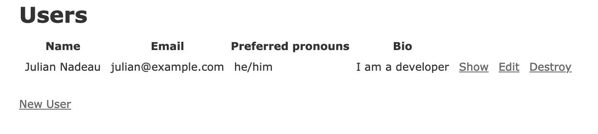

# Data Model (Part 1)

Rails applications are usually backed by a database. In [Starting with Rails](./1_starting_with_rails.md) we initialized this application with MySQL. In the last step we initialized the MySQL database with the following command: `bin/rails db:create`. This will load the configuration file `config/database.yml` and create the database.

Now that we have our database, we can start to work with it. First, we need to design the data model that populates this application. Based on our requirements in [Project Introduction](./3_project_introduction.md), we need to 
create a table for (at least) each of the following:

- Users
- Channels
- Messages
- Memberships
- Notifications

Let's start with the Users table as it is the most important table in our application and it appears that most, if not all, other tables will connect to it somehow.

To generate the users table, we first need to know what columns we need to store. Considering the requirements, we know that we likely need: name, email, password*, pronouns, avatar*, bio, etc.

## Most Attributes

Columns/Attributes like name, email, bio, etc. are all attributes that we want to store in our database. These will use standard database column types like varchar, text, etc.

## Password

This attribute is a little more intriguing. We need to store the password in a secure way. There are a number of ways to do this securely such as using bcrypt, Rails' built in encryption, usin a gem like Devise to handle user auth, and others.

While we won't go in depth on these in this section, here is an overview of some of the options. We will look at these more in depth later on in the tutorial.

#### Rails' built in encryption

Rails' built in encryption is one of the easiest options. This option provides some default columns and attributes on a model, but nothing else. It uses the `bcrypt` gem under the hood to encrypt the data. [You can find the full documentation here](https://api.rubyonrails.org/classes/ActiveModel/SecurePassword/ClassMethods.html).

#### Devise

Devise is a gem that handles user authentication including views, model extensions, and controllers. It is a good option for us because it is easy to use and it is easy to configure. [You can find the full documentation here](https://github.com/heartcombo/devise)

#### Attr_encrypted

Attr_encrypted is a gem that encrypts attributes. By itself it is not enough as we still need to handle everything else. [You can find the full documentation here](https://github.com/attr-encrypted/attr_encrypted).

## Avatar

The avatar is actually a "blob" of data that represents a photo. While you could add a binary column, databases are not optimized for this.

In a later section we will handle this in a more efficient way so we will skip this for now.

## Generating the Table

Rails comes with database and database migration support built in. We can use the `bin/rails generate` command to generate various requirements, including migrations. What's more is that we can pass in the full table and changes to the table as arguments. [See the full documentation here](https://guides.rubyonrails.org/command_line.html#bin-rails-generate).

At this point, however, we also do not have any models, controllers, etc. In this case we can use a special command to generate a bunch of "scaffold code". This command will generate a model, controller, and views for us.

`bin/rails generate scaffold User name:string email:string pronouns:string bio:text`

This will generate the following files:
- `app/models/user.rb`
- `app/controllers/users_controller.rb`
- `app/views/users/{index, show, edit, new, _form}.html.erb`
- `db/migrate/TIMESTAMP_create_users.rb`
- Various test files
- Inject a rails routes to the user endpoints (`GET /users, GET /users/:id, POST /users, PATCH /users/:id, DELETE /users/:id`)

The database migration will contain:

```ruby
class CreateUsers < ActiveRecord::Migration[6.1]
  def change
    create_table :users do |t|
      t.string :name
      t.string :email
      t.string :pronouns
      t.text :bio
      t.timestamps
    end
  end
end
```

By default tables will have the primary key `id`, and `t.timestamps` indicates that we want the `created_at` and `updated_at` columns which will be managed automatically.

To run this, we need to run `bin/rails db:migrate`. This will create the table in the database by running the migration.

If we made a mistake, we could revert this by running `bin/rails db:rollback`. This will drop the table from the database. Most migrations can be rolled back, but you should not do this in production unless you are sure that you want to do so.

Finally, let's start the rails server again with `bin/rails s` and navigate to http://localhost:3000/users. You should see a blank table and a "new" button. Let's create a user.

# Action Items

1. Run `bin/rails generate scaffold User name:string email:string pronouns:string bio:text`
2. Run `bin/rails db:migrate`
3. Run `bin/rails s`
4. Navigate to http://localhost:3000/users
5. Create a user, go back to http://localhost:3000/users
6. Done!



# This section in the example app

All of this is auto-generated by commands. We did not modify anything by hand.

https://github.com/dcsil/rails-tutorial-example/commit/8c4b56c435a9a412e7acd2175160f62004c68d58

# Next Section
- [User Authentication](5_user_authentication.md)